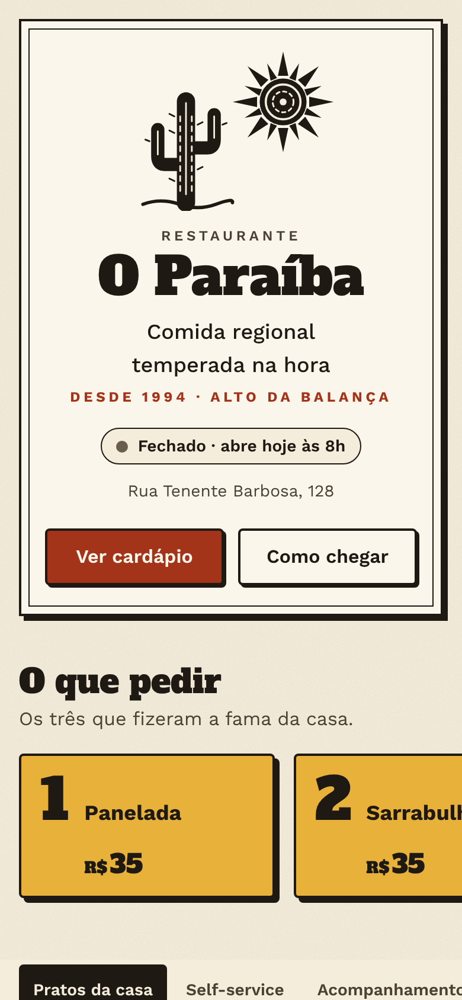
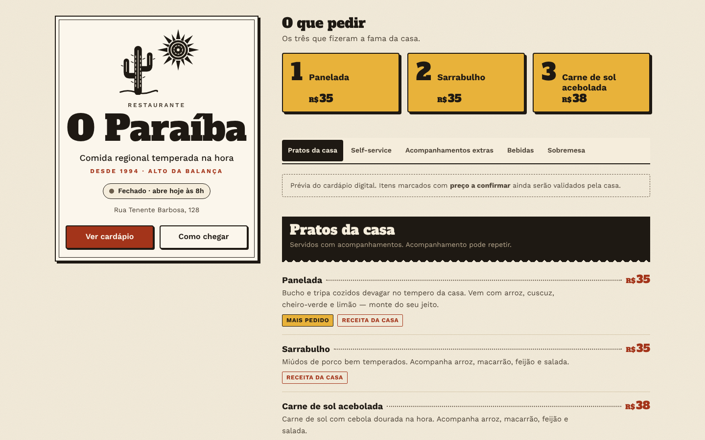
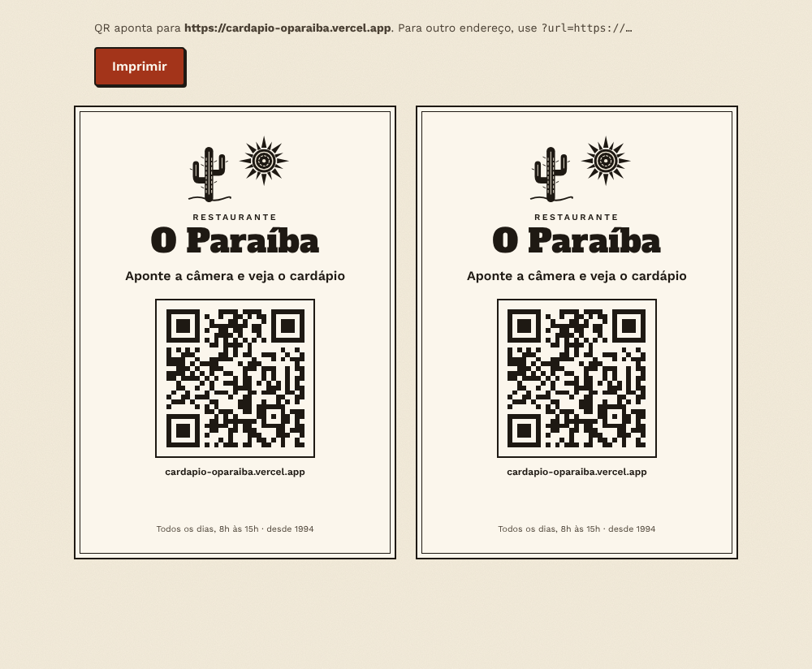

# Cardápio digital — Restaurante O Paraíba

Cardápio digital para o **Restaurante O Paraíba** (Rua Tenente Barbosa, 128 —
Alto da Balança, Fortaleza), casa de comida regional de Sebastião da Costa e
Maria do Socorro, aberta desde 1994. Antes deste projeto ela só existia no
Instagram (@restauranteoparaiba): sem site, sem cardápio digital, sem iFood.

- `/` — cardápio (feito para abrir pelo QR code da mesa)
- `/mesa.html` — cartão de mesa A6 com QR code, pronto para imprimir
  (`/mesa.html?url=https://endereco-final` para fixar o endereço do QR)

## Rodar

```bash
npm install
npm run dev          # http://localhost:5173
npm run typecheck
npm test             # unitários (horário/fuso, preços, contraste, dados)
PW_CHROMIUM_PATH=/opt/pw-browsers/chromium npm run test:e2e   # 390 px e 1440 px + axe
npm run build        # site estático em dist/
```

Publicar na Vercel: importar o repositório com **Root Directory =
`cardapio-o-paraiba`** (o `vercel.json` desta pasta já configura o build).

## Atualizar o cardápio

Tudo fica em dois arquivos, sem mexer em layout:

- `src/data/cardapio.ts` — categorias, pratos, preços (em centavos), etiquetas.
- `src/data/restaurante.ts` — endereço, horário, Instagram, WhatsApp, história.

## O que é real e o que falta confirmar com a casa

Verificado (matéria do Sabores da Cidade, 10/09/2026): endereço, horário (todo
dia 8h–15h), história, **panelada R$ 35**, **sarrabulho R$ 35**, **carne de sol
acebolada R$ 38**, **pudim R$ 7**, self-service **R$ 35–38**, acompanhamento
liberado e **taxa de R$ 5 por desperdício**.

Estimado para a prévia (`verificado: false`, aparece como "preço a confirmar"):
galinha caipira, bisteca, acompanhamentos extras e bebidas. Também falta o
**WhatsApp** (o botão aparece sozinho quando o número for preenchido).

Depois de validar com o Sebastião: marcar os itens como `verificado: true` e
trocar `MODO_PREVIA` para `false`.

Design: [docs/DESIGN_SYSTEM.md](docs/DESIGN_SYSTEM.md).

## Capturas

| Celular (390 px) | Desktop (1440 px) |
|---|---|
|  |  |

Cartão de mesa: 
